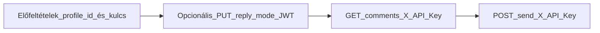

# Teljes folyamat: Facebook kommentek (B2B)

Ez a dokumentum bemutatja, hogyan lehet **külső backend rendszerrel** (CRM, ticketing, saját dashboard) a GLC-RAG-on keresztül kezelni a Facebook oldalhoz kötött **komment audit** folyamatot: válaszmód beállítása, kommentek listázása, majd **jóváhagyásos** módban a válasz elküldése a Facebookra.

**Hatókör és forrás:** Meta/Facebook termékintegráció; a végpontok a `/admin/fb` prefix alatt futnak. A nyilvános OpenAPI (openapi.json / Redoc) nem feltétlenül tartalmazza ezeket az útvonalakat ugyanilyen részletességgel. **Eltérés esetén a futó backend viselkedése és a Meta Graph API a döntő.** A többi quickstart oldalhoz hasonlóan ez az oldal **oktató jellegű**; a hivatalos contract a szerveren elérhető API specifikáció.

## Folyamat áttekintése

1. **Előfeltételek** – összekötött Facebook profil a tenantban, ismert `profile_id` (UUID), B2B API kulcs `fb_comment` scope-pal a listához és küldéshez.
2. **(Opcionális)** **Válaszmód** – `reply_mode`: `auto` (automata) vagy `manual` (jóváhagyás szükséges) beállítása vagy lekérése **JWT** (tenant admin) hitelesítéssel.
3. **Kommentek listája** – `GET .../comments` – **JWT** vagy **`X-API-Key`** (`fb_comment` scope).
4. **Válasz küldése** – `POST .../send` – csak akkor, ha a komment státusza `pending_approval` vagy `failed_manual` – **JWT** vagy **`X-API-Key`**.



## Előfeltételek

- A Facebook oldal **össze van kötve** a GLC-RAG admin felületén (OAuth, érvényes oldal token).
- **`profile_id`**: a profil belső UUID-ja. A **`GET /admin/fb/profiles`** (profillista) **csak tenant admin JWT-val** hívható; `fb_comment` API kulccsal **nem**. A `profile_id`-t tipikusan az admin UI-ból másolod, vagy egyszer rögzíted a külső rendszer konfigurációjában.
- **B2B integrációhoz** hozz létre (vagy használj) API kulcsot **`fb_comment` scope-pal** a komment lista és a küldés endpointokhoz. Részletek: [03-auth-api-key.md](./03-auth-api-key.md).

## Hitelesítés összefoglaló

| Művelet | Endpoint | Hitelesítés |
|---------|----------|-------------|
| Profil lekérése / módosítása (`reply_mode`) | `GET` / `PUT /admin/fb/profiles/{profile_id}` | **JWT** (tenant admin vagy system admin) |
| Profilok listája | `GET /admin/fb/profiles` | **JWT** (tenant admin) |
| Kommentek listája | `GET /admin/fb/profiles/{profile_id}/comments` | **JWT** (tenant admin) **vagy** **`X-API-Key`** + scope `fb_comment` |
| Válasz küldése | `POST /admin/fb/profiles/{profile_id}/comments/{comment_id}/send` | Ugyanaz |

---

## Lépés 0: Bejelentkezés (JWT) – opcionális, profil módhoz

Ha a válaszmódot API-n szeretnéd állítani vagy lekérni, szükség van **tenant admin** JWT-re. A bejelentkezés: `POST /auth/login`. Részletesen: [23-flow-login-then-chat.md](./23-flow-login-then-chat.md), [01-auth-jwt.md](./01-auth-jwt.md).

Az alábbi példákben: `ACCESS_TOKEN` = a login válasz `access_token` mezője.

---

## Lépés A: Válaszmód (`reply_mode`) – GET / PUT profil

### Jelentés

| Érték | Leírás |
|-------|--------|
| `auto` | Automata feldolgozás: a rendszer a profil szabályai szerint küldi a választ (nincs jóváhagyási lépés a küldés előtt, ahol a worker így működik). |
| `manual` | A válasz **jóváhagyásra vár** (`pending_approval`); a Facebookra a **`POST .../comments/{comment_id}/send`** hívással (vagy admin UI) lehet elküldeni. |

### PUT – mód beállítása

**Path:** `PUT /admin/fb/profiles/{profile_id}`

#### Request body (példa)

| Mező | Típus | Kötelező | Leírás |
|------|-------|----------|--------|
| **reply_mode** | string | Nem | `auto` vagy `manual` |

```json
{
  "reply_mode": "manual"
}
```

#### Python

```python
import requests

BASE_URL = "https://<your-api-host>"
ACCESS_TOKEN = "eyJhbGciOiJIUzI1NiIsInR5cCI6IkpXVCJ9..."
PROFILE_ID = "aaaaaaaa-bbbb-cccc-dddd-eeeeeeeeeeee"

url = f"{BASE_URL}/admin/fb/profiles/{PROFILE_ID}"
headers = {
    "Authorization": f"Bearer {ACCESS_TOKEN}",
    "Content-Type": "application/json",
}
response = requests.put(url, json={"reply_mode": "manual"}, headers=headers)
print(response.status_code, response.json())
```

#### TypeScript

```typescript
const BASE_URL = "https://<your-api-host>";
const ACCESS_TOKEN = "eyJhbGciOiJIUzI1NiIsInR5cCI6IkpXVCJ9...";
const PROFILE_ID = "aaaaaaaa-bbbb-cccc-dddd-eeeeeeeeeeee";

const response = await fetch(
  `${BASE_URL}/admin/fb/profiles/${PROFILE_ID}`,
  {
    method: "PUT",
    headers: {
      Authorization: `Bearer ${ACCESS_TOKEN}`,
      "Content-Type": "application/json",
    },
    body: JSON.stringify({ reply_mode: "manual" }),
  }
);
console.log(response.status, await response.json());
```

#### cURL

```bash
curl -X PUT "$BASE_URL/admin/fb/profiles/aaaaaaaa-bbbb-cccc-dddd-eeeeeeeeeeee" \
  -H "Authorization: Bearer $ACCESS_TOKEN" \
  -H "Content-Type: application/json" \
  -d '{"reply_mode": "manual"}'
```

#### PHP

```php
<?php
$BASE_URL = "https://<your-api-host>";
$ACCESS_TOKEN = "eyJhbGciOiJIUzI1NiIsInR5cCI6IkpXVCJ9...";
$PROFILE_ID = "aaaaaaaa-bbbb-cccc-dddd-eeeeeeeeeeee";

$payload = json_encode(["reply_mode" => "manual"]);
$ch = curl_init($BASE_URL . "/admin/fb/profiles/" . $PROFILE_ID);
curl_setopt($ch, CURLOPT_RETURNTRANSFER, true);
curl_setopt($ch, CURLOPT_CUSTOMREQUEST, "PUT");
curl_setopt($ch, CURLOPT_POSTFIELDS, $payload);
curl_setopt($ch, CURLOPT_HTTPHEADER, [
    "Content-Type: application/json",
    "Authorization: Bearer " . $ACCESS_TOKEN,
]);
$response = curl_exec($ch);
$code = curl_getinfo($ch, CURLINFO_HTTP_CODE);
curl_close($ch);
echo $code . " " . $response;
?>
```

### GET – aktuális mód és profil adatok

**Path:** `GET /admin/fb/profiles/{profile_id}`

A válasz tartalmazza a **`reply_mode`** mezőt (és pl. `id`, `fb_page_id`, `name`, `enabled`).

#### Python

```python
import requests

BASE_URL = "https://<your-api-host>"
ACCESS_TOKEN = "eyJhbGciOiJIUzI1NiIsInR5cCI6IkpXVCJ9..."
PROFILE_ID = "aaaaaaaa-bbbb-cccc-dddd-eeeeeeeeeeee"

r = requests.get(
    f"{BASE_URL}/admin/fb/profiles/{PROFILE_ID}",
    headers={"Authorization": f"Bearer {ACCESS_TOKEN}"},
)
print(r.json())
```

#### TypeScript

```typescript
const BASE_URL = "https://<your-api-host>";
const ACCESS_TOKEN = "eyJhbGciOiJIUzI1NiIsInR5cCI6IkpXVCJ9...";
const PROFILE_ID = "aaaaaaaa-bbbb-cccc-dddd-eeeeeeeeeeee";

const r = await fetch(`${BASE_URL}/admin/fb/profiles/${PROFILE_ID}`, {
  headers: { Authorization: `Bearer ${ACCESS_TOKEN}` },
});
console.log(await r.json());
```

#### cURL

```bash
curl -s "$BASE_URL/admin/fb/profiles/aaaaaaaa-bbbb-cccc-dddd-eeeeeeeeeeee" \
  -H "Authorization: Bearer $ACCESS_TOKEN"
```

#### PHP

```php
<?php
$BASE_URL = "https://<your-api-host>";
$ACCESS_TOKEN = "eyJhbGciOiJIUzI1NiIsInR5cCI6IkpXVCJ9...";
$PROFILE_ID = "aaaaaaaa-bbbb-cccc-dddd-eeeeeeeeeeee";

$ch = curl_init($BASE_URL . "/admin/fb/profiles/" . $PROFILE_ID);
curl_setopt($ch, CURLOPT_RETURNTRANSFER, true);
curl_setopt($ch, CURLOPT_HTTPHEADER, [
    "Authorization: Bearer " . $ACCESS_TOKEN,
]);
echo curl_exec($ch);
curl_close($ch);
?>
```

---

## Lépés B: Kommentek listája

**Path:** `GET /admin/fb/profiles/{profile_id}/comments`

### Query paraméterek

| Paraméter | Típus | Alapértelmezett | Leírás |
|-----------|-------|-----------------|--------|
| **page** | int | 1 | Lap száma (≥ 1) |
| **page_size** | int | 20 | Méret (1–100) |
| **search** | string | – | Keresés az `original_message` és `our_reply` mezőkben |
| **status** | string | – | Szűrés státusz szerint (pl. `pending_approval`, `posted`, `failed_manual`) |

### Válasz – egy komment mezői (kivonat)

| Mező | Leírás |
|------|--------|
| **id** | Belső UUID – a **`/send` híváshoz** ezt használd (`comment_id`). |
| **fb_comment_id** | Facebook komment azonosító |
| **fb_post_id** | Poszt azonosító |
| **original_message** | Bejövő komment szövege |
| **our_reply** | Generált / szerkesztett válasz szöveg (ha van) |
| **status** | pl. `pending_approval`, `posted`, `failed_manual`, … |
| **processed_at** | Feldolgozás időpontja |

**Megjegyzés:** A lista **audit jellegű**: egy sor egy bejövő kommenthez tartozó rekord a válasz szöveggel; nem helyettesíti a teljes Facebook beszélgetésfa Graph API-ból való lekérését.

### Példa – csak jóváhagyásra várók (B2B kulcs)

#### Python

```python
import requests

BASE_URL = "https://<your-api-host>"
API_KEY = "rak_your_api_key_with_fb_comment_scope"
PROFILE_ID = "aaaaaaaa-bbbb-cccc-dddd-eeeeeeeeeeee"

r = requests.get(
    f"{BASE_URL}/admin/fb/profiles/{PROFILE_ID}/comments",
    params={"page": 1, "page_size": 20, "status": "pending_approval"},
    headers={
        "X-API-Key": API_KEY,
        "Accept": "application/json",
    },
)
print(r.status_code, r.json())
```

#### TypeScript

```typescript
const BASE_URL = "https://<your-api-host>";
const API_KEY = "rak_your_api_key_with_fb_comment_scope";
const PROFILE_ID = "aaaaaaaa-bbbb-cccc-dddd-eeeeeeeeeeee";

const params = new URLSearchParams({
  page: "1",
  page_size: "20",
  status: "pending_approval",
});
const r = await fetch(
  `${BASE_URL}/admin/fb/profiles/${PROFILE_ID}/comments?${params}`,
  { headers: { "X-API-Key": API_KEY } }
);
console.log(await r.json());
```

#### cURL

```bash
curl -s -G "$BASE_URL/admin/fb/profiles/aaaaaaaa-bbbb-cccc-dddd-eeeeeeeeeeee/comments" \
  --data-urlencode "page=1" \
  --data-urlencode "page_size=20" \
  --data-urlencode "status=pending_approval" \
  -H "X-API-Key: rak_your_api_key_with_fb_comment_scope"
```

#### PHP

```php
<?php
$BASE_URL = "https://<your-api-host>";
$API_KEY = "rak_your_api_key_with_fb_comment_scope";
$PROFILE_ID = "aaaaaaaa-bbbb-cccc-dddd-eeeeeeeeeeee";

$query = http_build_query([
    "page" => 1,
    "page_size" => 20,
    "status" => "pending_approval",
]);
$ch = curl_init($BASE_URL . "/admin/fb/profiles/" . $PROFILE_ID . "/comments?" . $query);
curl_setopt($ch, CURLOPT_RETURNTRANSFER, true);
curl_setopt($ch, CURLOPT_HTTPHEADER, ["X-API-Key: " . $API_KEY]);
echo curl_exec($ch);
curl_close($ch);
?>
```

---

## Lépés C: Válasz küldése Facebookra (`send`)

**Path:** `POST /admin/fb/profiles/{profile_id}/comments/{comment_id}/send`

- **comment_id:** a lista válaszában szereplő **`id`** (belső UUID), nem a `fb_comment_id`.

### Request body (opcionális)

```json
{
  "our_reply": "A végleges válasz szövege, ha felül szeretnéd írni a tárolt szöveget."
}
```

Ha elhagyod a body-t vagy az `our_reply` üres, a backend a rekordban tárolt `our_reply` szöveget küldi – annak is **nem üres** stringnek kell lennie.

### Feltételek és hibák

| HTTP | Ok |
|------|-----|
| 400 | A komment státusza nem `pending_approval` és nem `failed_manual`, vagy nincs küldhető szöveg. |
| 401 | Hiányzó vagy érvénytelen `X-API-Key` / JWT. |
| 403 | Nincs jogosultság (pl. kulcs scope). |
| 404 | Ismeretlen profil vagy komment. |
| 502 | Facebook Graph API hiba a küldés során (részlet a válaszban). |

#### Python

```python
import requests

BASE_URL = "https://<your-api-host>"
API_KEY = "rak_your_api_key_with_fb_comment_scope"
PROFILE_ID = "aaaaaaaa-bbbb-cccc-dddd-eeeeeeeeeeee"
COMMENT_ID = "ffffffff-aaaa-bbbb-cccc-dddddddddddd"

url = f"{BASE_URL}/admin/fb/profiles/{PROFILE_ID}/comments/{COMMENT_ID}/send"
r = requests.post(
    url,
    json={"our_reply": "Köszönjük a megjegyzést, hamarosan jelentkezünk."},
    headers={
        "Content-Type": "application/json",
        "X-API-Key": API_KEY,
    },
)
print(r.status_code, r.text)
```

#### TypeScript

```typescript
const BASE_URL = "https://<your-api-host>";
const API_KEY = "rak_your_api_key_with_fb_comment_scope";
const PROFILE_ID = "aaaaaaaa-bbbb-cccc-dddd-eeeeeeeeeeee";
const COMMENT_ID = "ffffffff-aaaa-bbbb-cccc-dddddddddddd";

const r = await fetch(
  `${BASE_URL}/admin/fb/profiles/${PROFILE_ID}/comments/${COMMENT_ID}/send`,
  {
    method: "POST",
    headers: {
      "Content-Type": "application/json",
      "X-API-Key": API_KEY,
    },
    body: JSON.stringify({
      our_reply: "Köszönjük a megjegyzést, hamarosan jelentkezünk.",
    }),
  }
);
console.log(r.status, await r.text());
```

#### cURL

```bash
curl -X POST \
  "$BASE_URL/admin/fb/profiles/aaaaaaaa-bbbb-cccc-dddd-eeeeeeeeeeee/comments/ffffffff-aaaa-bbbb-cccc-dddddddddddd/send" \
  -H "Content-Type: application/json" \
  -H "X-API-Key: rak_your_api_key_with_fb_comment_scope" \
  -d '{"our_reply":"Köszönjük a megjegyzést, hamarosan jelentkezünk."}'
```

#### PHP

```php
<?php
$BASE_URL = "https://<your-api-host>";
$API_KEY = "rak_your_api_key_with_fb_comment_scope";
$PROFILE_ID = "aaaaaaaa-bbbb-cccc-dddd-eeeeeeeeeeee";
$COMMENT_ID = "ffffffff-aaaa-bbbb-cccc-dddddddddddd";

$payload = json_encode([
    "our_reply" => "Köszönjük a megjegyzést, hamarosan jelentkezünk.",
]);
$url = $BASE_URL . "/admin/fb/profiles/" . $PROFILE_ID . "/comments/" . $COMMENT_ID . "/send";
$ch = curl_init($url);
curl_setopt($ch, CURLOPT_RETURNTRANSFER, true);
curl_setopt($ch, CURLOPT_POST, true);
curl_setopt($ch, CURLOPT_POSTFIELDS, $payload);
curl_setopt($ch, CURLOPT_HTTPHEADER, [
    "Content-Type: application/json",
    "X-API-Key: " . $API_KEY,
]);
echo curl_exec($ch);
curl_close($ch);
?>
```

---

## Kapcsolódó dokumentumok

- [03-auth-api-key.md](./03-auth-api-key.md) – API kulcs, scope-ok (köztük `fb_comment`)
- [01-auth-jwt.md](./01-auth-jwt.md) – JWT hitelesítés
- [23-flow-login-then-chat.md](./23-flow-login-then-chat.md) – bejelentkezés és token
- [41-endpoint-matrix.md](./41-endpoint-matrix.md) – endpoint áttekintés
