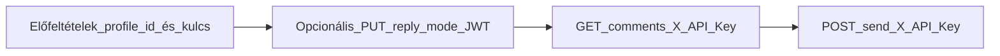

# Teljes folyamat: Facebook kommentek (B2B)

Ez a dokumentum bemutatja, hogyan lehet **külső backend rendszerrel** (CRM, ticketing, saját dashboard) a GLC-RAG-on keresztül kezelni a Facebook oldalhoz kötött **komment audit** folyamatot: válaszmód beállítása, kommentek listázása, majd **jóváhagyásos** módban a válasz elküldése a Facebookra.

**Hatókör és forrás:** Meta/Facebook termékintegráció; a végpontok a `/admin/fb` prefix alatt futnak. A nyilvános OpenAPI (openapi.json / Redoc) nem feltétlenül tartalmazza ezeket az útvonalakat ugyanilyen részletességgel. **Eltérés esetén a futó backend viselkedése és a Meta Graph API a döntő.** A többi quickstart oldalhoz hasonlóan ez az oldal **oktató jellegű**; a hivatalos contract a szerveren elérhető API specifikáció.

## Folyamat áttekintése

1. **Előfeltételek** – összekötött Facebook profil a tenantban, ismert `profile_id` (UUID), B2B API kulcs `fb_comment` scope-pal a listához és küldéshez.
2. **(Opcionális)** **Válaszmód** – `reply_mode`: `auto` (automata) vagy `manual` (jóváhagyás szükséges) beállítása vagy lekérése **JWT** (tenant admin) hitelesítéssel.
3. **Kommentek listája** – `GET .../comments` – **JWT** vagy **`X-API-Key`** (`fb_comment` scope).
4. **Válasz küldése** – `POST .../send` – csak akkor, ha a komment státusza `pending_approval` vagy `failed_manual` – **JWT** vagy **`X-API-Key`**.



## Előfeltételek

- A Facebook oldal **össze van kötve** a GLC-RAG admin felületén (OAuth, érvényes oldal token).
- **`profile_id`**: a profil belső UUID-ja. A **`GET /admin/fb/profiles`** (profillista) **csak tenant admin JWT-val** hívható; `fb_comment` API kulccsal **nem**. A `profile_id`-t tipikusan az admin UI-ból másolod, vagy egyszer rögzíted a külső rendszer konfigurációjában.
- **B2B integrációhoz** hozz létre (vagy használj) API kulcsot **`fb_comment` scope-pal** a komment lista és a küldés endpointokhoz. Részletek: [03-auth-api-key.md](./03-auth-api-key.md).

## Hitelesítés összefoglaló

| Művelet | Endpoint | Hitelesítés |
|---------|----------|-------------|
| Profil lekérése / módosítása (`reply_mode`) | `GET` / `PUT /admin/fb/profiles/{profile_id}` | **JWT** (tenant admin vagy system admin) |
| Profilok listája | `GET /admin/fb/profiles` | **JWT** (tenant admin) |
| Kommentek listája | `GET /admin/fb/profiles/{profile_id}/comments` | **JWT** (tenant admin) **vagy** **`X-API-Key`** + scope `fb_comment` |
| Válasz küldése | `POST /admin/fb/profiles/{profile_id}/comments/{comment_id}/send` | Ugyanaz |
| Dokumentum találatok kommenthez (RAG) | `POST /admin/fb/profiles/{profile_id}/comments/retrieve` | Ugyanaz (`fb_comment`) |
| Termék találatok kommenthez (shop index) | `POST /admin/fb/profiles/{profile_id}/comments/retrieve-products` | Ugyanaz |
| Válasz formázás listából (aszinkron job) | `POST .../comments/format-reply/start` + `GET .../comments/format-reply/status` | Ugyanaz |

## Válaszszöveg (`our_reply`) — automata mód, lista, és miért **nem** a `/chat`

### Automatikus mód (háttér worker)

Az **automata** Facebook válasz **nem** a `POST /chat` vagy `POST /api/v1/chat` endpointon fut. A háttér **`fb_comment_worker`** a webhook / sor alapján:

1. **LLM-mel besorolja** a kommentet a profil **törzsadatcsoportjaiba** (adatcsoportok, leírásokkal).
2. Ha van illő csoport, a kiválasztott csoportokhoz tartozó **tartalombejegyzéseket** olvassa ki (Facebook modul saját tára, legfeljebb 100 rekord) — ez az **„adott lista”**, amihez a válaszgenerálás kötődik.
3. Ugyanazon a **`fb_commenter`** LLM végponton generál választ úgy, hogy **csak ezekből a szövegekből** dolgozzon (nem a teljes belső chat pipeline).
4. Ha nincs megfelelő csoport / üres lista: a profil **fallback** beállításai és LLM léphet életbe.

Tehát az automata válasz **adatcsoport + tartalomlista + FB dedikált LLM**, nem „általános chat” API.

### Jóváhagyásos felület és B2B — ugyanaz a **találatlista → kiválasztás → formázás** út

A Facebook komment válaszoló **admin UI** (és ezzel megegyezően külső rendszer **`fb_comment` kulccsal**) tipikusan:

1. **`POST /admin/fb/profiles/{profile_id}/comments/retrieve`** — törzs: `{"query": "<komment vagy keresőszöveg>"}` — **dokumentum** találatok (`matches`: fájlnév, score, `content` snippet).
2. **`POST /admin/fb/profiles/{profile_id}/comments/retrieve-products`** — törzs: `{"query": "..."}` — **termék** találatok (név, ár, link, stb.).
3. A felhasználó / integráció a listából **kiválasztott szövegblokkokkal** hívja:  
   **`POST /admin/fb/profiles/{profile_id}/comments/format-reply/start`**  
   Kötelező mezők: `query` (komment), `source`: `"rag"` vagy `"shop"`, `selected_contents`: string tömb (a találatok `content` / leírás szövegeiből összeállítva). Opcionális: `post_text` (poszt szövege kontextusnak).
4. A válasz: **`201`** és egy **`job_id`**. Ezután poll:  
   **`GET /admin/fb/profiles/{profile_id}/comments/format-reply/status?job_id=<job_id>`**  
   amíg `status` nem lesz `done` → ekkor a **`formatted_reply`** a kész válasz szöveg (vagy `error`).

Minden fenti útvonal: **JWT** vagy **`X-API-Key`** + scope **`fb_comment`** — **nem** kell hozzájuk belső `POST /chat`.

### `our_reply` a listában és küldés

- A **`GET .../comments`** rekordok **`our_reply`** mezőjét a worker vagy a jóváhagyási folyamat tölti; külső rendszer **olvashatja** onnan.
- **`POST .../send`** törzsében opcionálisan **`our_reply`** felülírható, majd küldés (státusz: `pending_approval` vagy `failed_manual`).

### Miért jön „jelentkezz be a chathez” vagy „érvénytelen / lejárt token” hiba a chatből?

A **`POST /chat`** és **`POST /chat/stream`** *internal* csatornához **érvényes felhasználói JWT** kell az `Authorization: Bearer …` headerben. Ez **nem** a Facebook komment B2B integráció része.

Gyakori **HTTP 401** válaszok (a `detail` mező tipikusan angolul jön a szervertől):

| `detail` (vagy hasonló) | Jelentés |
|-------------------------|----------|
| `JWT token required for internal channel (Authorization: Bearer <token>)` | Nincs Bearer token, vagy üres a fejléc. |
| `Invalid or expired JWT token` | A token lejárt, hibás aláírású, vagy a szerver már nem fogadja el (pl. kulcscsere). |

A **frontend** néha ezeket egybefűzi, és magyar szöveget is mutathat (pl. session törlése / „jelentkezz be újra”) — a gyökér ugyanaz: **belső chat JWT**, nem Facebook API.

**Mit tegyél Facebook kommenthez B2B-ből?** Ne a belső `/chat`-et hívd; használd a **`X-API-Key`** + **`fb_comment`** scope-ú végpontokat (`retrieve`, `format-reply`, `send`, stb.) — ezek **nem** a belső chat JWT-jétől függenek. Ha mégis belső chat kell: új token **`POST /auth/login`**-nal ([23-flow-login-then-chat.md](./23-flow-login-then-chat.md)), és figyeld az `expires_in` / lejáratot.

### Miért jön „érvénytelen vagy lejárt API kulcs” / X-API-Key hiba?

A Facebook komment **`/admin/fb/profiles/...`** végpontjai **JWT** *vagy* **`X-API-Key`** + scope **`fb_comment`** alatt futnak. Ha a kulcsos utat használod, **401** esetén a válasz **`detail`** mezője a szerveren tipikusan **angol** és konkrét (lásd táblázat). A saját alkalmazásod, egy **proxy** vagy egy **lefordított / egységesített** hibaüzenet összefoglalhatja ezt magyarul is (pl. „Érvénytelen vagy lejárt API kulcs. Ellenőrizze az X-API-Key fejlécet.”) — a teendő ugyanaz: fejléc + érvényes kulcs + scope + tenant.

| `detail` (tipikus, angol) | Mit csinálj |
|---------------------------|-------------|
| `X-API-Key or Bearer token required` | Adj meg **`X-API-Key: rak_...`** headert, vagy tenant admin **Bearer** JWT-t. |
| `Invalid API key` | Újra másold a kulcsot (env / titokkezelő); **rotate** után a régi kulcs azonnal érvénytelen. Ellenőrizd, hogy a **jó környezet** (BASE_URL) tenantjához tartozó kulcsot használod. |
| `API key has expired` | Admin → **API Keys**: hosszabbítsd meg a lejáratot, vagy hozz létre új kulcsot. |
| `API key is disabled` | Kapcsold vissza a kulcsot, vagy használj másikat. |
| `API key does not have 'fb_comment' scope` | A kulcshoz add hozzá a **`fb_comment`** scope-ot (több scope egy kulcson engedélyezett). |
| `Invalid API key format` | A kulcs **`rak_`** előtaggal kezdődjön; ne legyen felesleges idézőjel / sortörés a titokban. |

**Fontos:** az API kulcs **egy adott tenant-hoz** kötött. A **`profile_id`** ennek a tenantnak a Facebook profilja kell legyen — más tenant kulcsával ugyanaz az UUID nem lesz elérhető (tipikusan 404 „Profile not found”, nem feltétlenül „invalid key”).

Részletes táblázat és általános tippek minden kulcsos végpontra: [03-auth-api-key.md](./03-auth-api-key.md).

### Általános B2B chat (`POST /api/v1/chat`)

A **`POST /api/v1/chat`** a tenant **általános** kulcsos chatje (RAG / shopping / creative stb., lásd [03-auth-api-key.md](./03-auth-api-key.md), [12-api-v1-chat.md](./12-api-v1-chat.md)). **Nem** ugyanaz a pipeline, mint a Facebook komment válaszoló **lista + format-reply** vagy az automata worker **adatcsoport-tartalom** logikája; csak akkor érdemes erre támaszkodni, ha szándékosan azt az API-t akarod, nem a Facebook modul végpontjait.

A [23-flow-login-then-chat.md](./23-flow-login-then-chat.md) a **JWT + belső `/chat`** példát mutatja; a komment **lista / küldés / retrieve / format-reply** **elvégezhető** kizárólag **`fb_comment`** API kulccsal is, JWT nélkül.

---

## Lépés 0: Bejelentkezés (JWT) – opcionális, csak profil / válaszmódhoz

Ha a **`reply_mode`** értékét API-n szeretnéd **beállítani vagy lekérni** (`GET` / `PUT /admin/fb/profiles/{profile_id}`), szükség van **tenant admin** JWT-re. A bejelentkezés: `POST /auth/login`. Részletesen: [23-flow-login-then-chat.md](./23-flow-login-then-chat.md) (JWT + belső chat példa — utóbbi **nem** része a Facebook B2B komment API-nak), [01-auth-jwt.md](./01-auth-jwt.md).

**Ha csak** kommentet listázol és jóváhagyással küldesz, és van **`fb_comment`** scope-ú API kulcsod, **ehhez a lépéshez nincs szükség JWT-re.**

Az alábbi példákben: `ACCESS_TOKEN` = a login válasz `access_token` mezője.

---

## Lépés A: Válaszmód (`reply_mode`) – GET / PUT profil

### Jelentés

| Érték | Leírás |
|-------|--------|
| `auto` | Automata feldolgozás: a rendszer a profil szabályai szerint küldi a választ (nincs jóváhagyási lépés a küldés előtt, ahol a worker így működik). |
| `manual` | A válasz **jóváhagyásra vár** (`pending_approval`); a Facebookra a **`POST .../comments/{comment_id}/send`** hívással (vagy admin UI) lehet elküldeni. |

### PUT – mód beállítása

**Path:** `PUT /admin/fb/profiles/{profile_id}`

#### Request body (példa)

| Mező | Típus | Kötelező | Leírás |
|------|-------|----------|--------|
| **reply_mode** | string | Nem | `auto` vagy `manual` |

```json
{
  "reply_mode": "manual"
}
```

#### Python

```python
import requests

BASE_URL = "https://<your-api-host>"
ACCESS_TOKEN = "eyJhbGciOiJIUzI1NiIsInR5cCI6IkpXVCJ9..."
PROFILE_ID = "aaaaaaaa-bbbb-cccc-dddd-eeeeeeeeeeee"

url = f"{BASE_URL}/admin/fb/profiles/{PROFILE_ID}"
headers = {
    "Authorization": f"Bearer {ACCESS_TOKEN}",
    "Content-Type": "application/json",
}
response = requests.put(url, json={"reply_mode": "manual"}, headers=headers)
print(response.status_code, response.json())
```

#### TypeScript

```typescript
const BASE_URL = "https://<your-api-host>";
const ACCESS_TOKEN = "eyJhbGciOiJIUzI1NiIsInR5cCI6IkpXVCJ9...";
const PROFILE_ID = "aaaaaaaa-bbbb-cccc-dddd-eeeeeeeeeeee";

const response = await fetch(
  `${BASE_URL}/admin/fb/profiles/${PROFILE_ID}`,
  {
    method: "PUT",
    headers: {
      Authorization: `Bearer ${ACCESS_TOKEN}`,
      "Content-Type": "application/json",
    },
    body: JSON.stringify({ reply_mode: "manual" }),
  }
);
console.log(response.status, await response.json());
```

#### cURL

```bash
curl -X PUT "$BASE_URL/admin/fb/profiles/aaaaaaaa-bbbb-cccc-dddd-eeeeeeeeeeee" \
  -H "Authorization: Bearer $ACCESS_TOKEN" \
  -H "Content-Type: application/json" \
  -d '{"reply_mode": "manual"}'
```

#### PHP

```php
<?php
$BASE_URL = "https://<your-api-host>";
$ACCESS_TOKEN = "eyJhbGciOiJIUzI1NiIsInR5cCI6IkpXVCJ9...";
$PROFILE_ID = "aaaaaaaa-bbbb-cccc-dddd-eeeeeeeeeeee";

$payload = json_encode(["reply_mode" => "manual"]);
$ch = curl_init($BASE_URL . "/admin/fb/profiles/" . $PROFILE_ID);
curl_setopt($ch, CURLOPT_RETURNTRANSFER, true);
curl_setopt($ch, CURLOPT_CUSTOMREQUEST, "PUT");
curl_setopt($ch, CURLOPT_POSTFIELDS, $payload);
curl_setopt($ch, CURLOPT_HTTPHEADER, [
    "Content-Type: application/json",
    "Authorization: Bearer " . $ACCESS_TOKEN,
]);
$response = curl_exec($ch);
$code = curl_getinfo($ch, CURLINFO_HTTP_CODE);
curl_close($ch);
echo $code . " " . $response;
?>
```

### GET – aktuális mód és profil adatok

**Path:** `GET /admin/fb/profiles/{profile_id}`

A válasz tartalmazza a **`reply_mode`** mezőt (és pl. `id`, `fb_page_id`, `name`, `enabled`).

#### Python

```python
import requests

BASE_URL = "https://<your-api-host>"
ACCESS_TOKEN = "eyJhbGciOiJIUzI1NiIsInR5cCI6IkpXVCJ9..."
PROFILE_ID = "aaaaaaaa-bbbb-cccc-dddd-eeeeeeeeeeee"

r = requests.get(
    f"{BASE_URL}/admin/fb/profiles/{PROFILE_ID}",
    headers={"Authorization": f"Bearer {ACCESS_TOKEN}"},
)
print(r.json())
```

#### TypeScript

```typescript
const BASE_URL = "https://<your-api-host>";
const ACCESS_TOKEN = "eyJhbGciOiJIUzI1NiIsInR5cCI6IkpXVCJ9...";
const PROFILE_ID = "aaaaaaaa-bbbb-cccc-dddd-eeeeeeeeeeee";

const r = await fetch(`${BASE_URL}/admin/fb/profiles/${PROFILE_ID}`, {
  headers: { Authorization: `Bearer ${ACCESS_TOKEN}` },
});
console.log(await r.json());
```

#### cURL

```bash
curl -s "$BASE_URL/admin/fb/profiles/aaaaaaaa-bbbb-cccc-dddd-eeeeeeeeeeee" \
  -H "Authorization: Bearer $ACCESS_TOKEN"
```

#### PHP

```php
<?php
$BASE_URL = "https://<your-api-host>";
$ACCESS_TOKEN = "eyJhbGciOiJIUzI1NiIsInR5cCI6IkpXVCJ9...";
$PROFILE_ID = "aaaaaaaa-bbbb-cccc-dddd-eeeeeeeeeeee";

$ch = curl_init($BASE_URL . "/admin/fb/profiles/" . $PROFILE_ID);
curl_setopt($ch, CURLOPT_RETURNTRANSFER, true);
curl_setopt($ch, CURLOPT_HTTPHEADER, [
    "Authorization: Bearer " . $ACCESS_TOKEN,
]);
echo curl_exec($ch);
curl_close($ch);
?>
```

---

## Lépés B: Kommentek listája

**Path:** `GET /admin/fb/profiles/{profile_id}/comments`

### Query paraméterek

| Paraméter | Típus | Alapértelmezett | Leírás |
|-----------|-------|-----------------|--------|
| **page** | int | 1 | Lap száma (≥ 1) |
| **page_size** | int | 20 | Méret (1–100) |
| **search** | string | – | Keresés az `original_message` és `our_reply` mezőkben |
| **status** | string | – | Szűrés státusz szerint (pl. `pending_approval`, `posted`, `failed_manual`) |

### Válasz – egy komment mezői (kivonat)

| Mező | Leírás |
|------|--------|
| **id** | Belső UUID – a **`/send` híváshoz** ezt használd (`comment_id`). |
| **fb_comment_id** | Facebook komment azonosító |
| **fb_post_id** | Poszt azonosító |
| **original_message** | Bejövő komment szövege |
| **our_reply** | Generált / szerkesztett válasz szöveg (ha van) |
| **status** | pl. `pending_approval`, `posted`, `failed_manual`, … |
| **processed_at** | Feldolgozás időpontja |

**Megjegyzés:** A lista **audit jellegű**: egy sor egy bejövő kommenthez tartozó rekord a válasz szöveggel; nem helyettesíti a teljes Facebook beszélgetésfa Graph API-ból való lekérését.

### Példa – csak jóváhagyásra várók (B2B kulcs)

#### Python

```python
import requests

BASE_URL = "https://<your-api-host>"
API_KEY = "rak_your_api_key_with_fb_comment_scope"
PROFILE_ID = "aaaaaaaa-bbbb-cccc-dddd-eeeeeeeeeeee"

r = requests.get(
    f"{BASE_URL}/admin/fb/profiles/{PROFILE_ID}/comments",
    params={"page": 1, "page_size": 20, "status": "pending_approval"},
    headers={
        "X-API-Key": API_KEY,
        "Accept": "application/json",
    },
)
print(r.status_code, r.json())
```

#### TypeScript

```typescript
const BASE_URL = "https://<your-api-host>";
const API_KEY = "rak_your_api_key_with_fb_comment_scope";
const PROFILE_ID = "aaaaaaaa-bbbb-cccc-dddd-eeeeeeeeeeee";

const params = new URLSearchParams({
  page: "1",
  page_size: "20",
  status: "pending_approval",
});
const r = await fetch(
  `${BASE_URL}/admin/fb/profiles/${PROFILE_ID}/comments?${params}`,
  { headers: { "X-API-Key": API_KEY } }
);
console.log(await r.json());
```

#### cURL

```bash
curl -s -G "$BASE_URL/admin/fb/profiles/aaaaaaaa-bbbb-cccc-dddd-eeeeeeeeeeee/comments" \
  --data-urlencode "page=1" \
  --data-urlencode "page_size=20" \
  --data-urlencode "status=pending_approval" \
  -H "X-API-Key: rak_your_api_key_with_fb_comment_scope"
```

#### PHP

```php
<?php
$BASE_URL = "https://<your-api-host>";
$API_KEY = "rak_your_api_key_with_fb_comment_scope";
$PROFILE_ID = "aaaaaaaa-bbbb-cccc-dddd-eeeeeeeeeeee";

$query = http_build_query([
    "page" => 1,
    "page_size" => 20,
    "status" => "pending_approval",
]);
$ch = curl_init($BASE_URL . "/admin/fb/profiles/" . $PROFILE_ID . "/comments?" . $query);
curl_setopt($ch, CURLOPT_RETURNTRANSFER, true);
curl_setopt($ch, CURLOPT_HTTPHEADER, ["X-API-Key: " . $API_KEY]);
echo curl_exec($ch);
curl_close($ch);
?>
```

---

## Opcionális: dokumentumtalálatok és formázott válasz (`retrieve` + `format-reply`)

Ha a **`our_reply` nincs meg** vagy felül szeretnéd állítani **ugyanazzal a logikával**, mint a Facebook komment válaszoló admin (RAG lista → kiválasztott blokkok → LLM), hívd ezeket **`X-API-Key`** + **`fb_comment`** scope-szal (JWT is megfelel).

1. **`POST /admin/fb/profiles/{profile_id}/comments/retrieve`** — törzs: `{"query": "<szöveg>"}` → `matches[]` (`content`, `filename`, …).
2. Válassz egy vagy több **`content`** (vagy más, integrációdban használt) szöveget → **`selected_contents`** tömb.
3. **`POST /admin/fb/profiles/{profile_id}/comments/format-reply/start`** — `query` (komment), `source`: `"rag"` vagy `"shop"`, `selected_contents`, opcionálisan `post_text`.
4. **`GET .../format-reply/status?job_id=...`** poll, amíg `status` nem `done` → **`formatted_reply`**.

**Termékekhez:** `POST .../comments/retrieve-products` ugyanígy `{"query": "..."}`-vel; a `format-reply/start` hívásnál **`source` legyen `"shop"`**, és a `selected_contents` a termékblokkok szövegeiből álljon össze (ahogy az admin UI összerakja).

#### Python

```python
import time
import requests

BASE_URL = "https://<your-api-host>"
API_KEY = "rak_your_api_key_with_fb_comment_scope"
PROFILE_ID = "aaaaaaaa-bbbb-cccc-dddd-eeeeeeeeeeee"
COMMENT_TEXT = "Mikor vagytok nyitva hétvégén?"

headers = {
    "X-API-Key": API_KEY,
    "Content-Type": "application/json",
    "Accept": "application/json",
}

r = requests.post(
    f"{BASE_URL}/admin/fb/profiles/{PROFILE_ID}/comments/retrieve",
    json={"query": COMMENT_TEXT},
    headers=headers,
    timeout=60,
)
r.raise_for_status()
matches = r.json().get("matches") or []
selected = [m["content"] for m in matches if m.get("content")]
if not selected:
    raise SystemExit("Nincs RAG találat — próbáld másik query-vel vagy a retrieve-products útvonalat.")

start = requests.post(
    f"{BASE_URL}/admin/fb/profiles/{PROFILE_ID}/comments/format-reply/start",
    json={
        "query": COMMENT_TEXT,
        "source": "rag",
        "selected_contents": selected[:5],
        "post_text": None,
    },
    headers=headers,
    timeout=60,
)
start.raise_for_status()
job_id = start.json()["job_id"]

for _ in range(120):
    st = requests.get(
        f"{BASE_URL}/admin/fb/profiles/{PROFILE_ID}/comments/format-reply/status",
        params={"job_id": job_id},
        headers={"X-API-Key": API_KEY, "Accept": "application/json"},
        timeout=30,
    )
    st.raise_for_status()
    data = st.json()
    if data.get("status") == "done":
        print(data.get("formatted_reply"))
        break
    if data.get("status") == "error":
        raise RuntimeError(data.get("error") or "format-reply failed")
    time.sleep(0.5)
```

#### TypeScript

```typescript
const BASE_URL = "https://<your-api-host>";
const API_KEY = "rak_your_api_key_with_fb_comment_scope";
const PROFILE_ID = "aaaaaaaa-bbbb-cccc-dddd-eeeeeeeeeeee";
const COMMENT_TEXT = "Mikor vagytok nyitva hétvégén?";

const headers = {
  "X-API-Key": API_KEY,
  "Content-Type": "application/json",
  Accept: "application/json",
};

const ret = await fetch(
  `${BASE_URL}/admin/fb/profiles/${PROFILE_ID}/comments/retrieve`,
  { method: "POST", headers, body: JSON.stringify({ query: COMMENT_TEXT }) }
);
if (!ret.ok) throw new Error(await ret.text());
const { matches = [] } = await ret.json();
const selected = matches
  .map((m: { content?: string }) => m.content)
  .filter(Boolean) as string[];
if (!selected.length) throw new Error("Nincs RAG találat");

const start = await fetch(
  `${BASE_URL}/admin/fb/profiles/${PROFILE_ID}/comments/format-reply/start`,
  {
    method: "POST",
    headers,
    body: JSON.stringify({
      query: COMMENT_TEXT,
      source: "rag",
      selected_contents: selected.slice(0, 5),
      post_text: null,
    }),
  }
);
if (!start.ok) throw new Error(await start.text());
const { job_id } = await start.json();

let formatted: string | undefined;
for (let i = 0; i < 120; i++) {
  const st = await fetch(
    `${BASE_URL}/admin/fb/profiles/${PROFILE_ID}/comments/format-reply/status?job_id=${encodeURIComponent(job_id)}`,
    { headers: { "X-API-Key": API_KEY, Accept: "application/json" } }
  );
  if (!st.ok) throw new Error(await st.text());
  const data = await st.json();
  if (data.status === "done") {
    formatted = data.formatted_reply;
    break;
  }
  if (data.status === "error") throw new Error(data.error || "format-reply failed");
  await new Promise((r) => setTimeout(r, 500));
}
console.log(formatted);
```

#### cURL

```bash
# 1) RAG találatok
curl -s -X POST "$BASE_URL/admin/fb/profiles/aaaaaaaa-bbbb-cccc-dddd-eeeeeeeeeeee/comments/retrieve" \
  -H "Content-Type: application/json" \
  -H "X-API-Key: rak_your_api_key_with_fb_comment_scope" \
  -d '{"query":"Mikor vagytok nyitva hétvégén?"}'

# 2) A válaszból másold ki a használni kívánt szöveg(ek)et → SELECTED_JSON tömb (kézzel vagy scripttel).

# 3) Formázás indítása (SELECTED_JSON = pl. '["első chunk szöveg...","második..."]')
curl -s -X POST "$BASE_URL/admin/fb/profiles/aaaaaaaa-bbbb-cccc-dddd-eeeeeeeeeeee/comments/format-reply/start" \
  -H "Content-Type: application/json" \
  -H "X-API-Key: rak_your_api_key_with_fb_comment_scope" \
  -d "{\"query\":\"Mikor vagytok nyitva hétvégén?\",\"source\":\"rag\",\"selected_contents\":SELECTED_JSON}"

# 4) Poll (cseréld be a JOB_ID-t a start válasz job_id mezőjéből)
curl -s -G "$BASE_URL/admin/fb/profiles/aaaaaaaa-bbbb-cccc-dddd-eeeeeeeeeeee/comments/format-reply/status" \
  --data-urlencode "job_id=JOB_ID" \
  -H "X-API-Key: rak_your_api_key_with_fb_comment_scope"
```

#### PHP

```php
<?php
$BASE_URL = "https://<your-api-host>";
$API_KEY = "rak_your_api_key_with_fb_comment_scope";
$PROFILE_ID = "aaaaaaaa-bbbb-cccc-dddd-eeeeeeeeeeee";
$comment = "Mikor vagytok nyitva hétvégén?";

function fb_json_post($url, $apiKey, $body) {
    $ch = curl_init($url);
    curl_setopt($ch, CURLOPT_RETURNTRANSFER, true);
    curl_setopt($ch, CURLOPT_POST, true);
    curl_setopt($ch, CURLOPT_POSTFIELDS, json_encode($body));
    curl_setopt($ch, CURLOPT_HTTPHEADER, [
        "Content-Type: application/json",
        "X-API-Key: " . $apiKey,
        "Accept: application/json",
    ]);
    $out = curl_exec($ch);
    $code = curl_getinfo($ch, CURLINFO_HTTP_CODE);
    curl_close($ch);
    return [$code, $out];
}

[$c1, $r1] = fb_json_post(
    $BASE_URL . "/admin/fb/profiles/" . $PROFILE_ID . "/comments/retrieve",
    $API_KEY,
    ["query" => $comment]
);
if ($c1 !== 200) {
    exit("retrieve HTTP $c1: $r1\n");
}
$matches = json_decode($r1, true)["matches"] ?? [];
$selected = [];
foreach ($matches as $m) {
    if (!empty($m["content"])) {
        $selected[] = $m["content"];
    }
}
$selected = array_slice($selected, 0, 5);
if (!$selected) {
    exit("Nincs RAG találat.\n");
}

[$c2, $r2] = fb_json_post(
    $BASE_URL . "/admin/fb/profiles/" . $PROFILE_ID . "/comments/format-reply/start",
    $API_KEY,
    [
        "query" => $comment,
        "source" => "rag",
        "selected_contents" => $selected,
        "post_text" => null,
    ]
);
if ($c2 !== 201) {
    exit("format-reply/start HTTP $c2: $r2\n");
}
$jobId = json_decode($r2, true)["job_id"] ?? "";
if ($jobId === "") {
    exit("Nincs job_id\n");
}

for ($i = 0; $i < 120; $i++) {
    $url = $BASE_URL . "/admin/fb/profiles/" . $PROFILE_ID . "/comments/format-reply/status?job_id=" . rawurlencode($jobId);
    $ch = curl_init($url);
    curl_setopt($ch, CURLOPT_RETURNTRANSFER, true);
    curl_setopt($ch, CURLOPT_HTTPHEADER, [
        "X-API-Key: " . $API_KEY,
        "Accept: application/json",
    ]);
    $rs = curl_exec($ch);
    curl_close($ch);
    $data = json_decode($rs, true);
    if (($data["status"] ?? "") === "done") {
        echo $data["formatted_reply"] ?? "";
        exit(0);
    }
    if (($data["status"] ?? "") === "error") {
        exit("format-reply error: " . ($data["error"] ?? "") . "\n");
    }
    usleep(500000);
}
exit("timeout polling format-reply\n");
?>
```

A kapott **`formatted_reply`** szöveget ezután a **`POST .../comments/{comment_id}/send`** törzsében **`our_reply`** mezőben is elküldheted (ha a rekord státusza engedi).

---

## Lépés C: Válasz küldése Facebookra (`send`)

**Path:** `POST /admin/fb/profiles/{profile_id}/comments/{comment_id}/send`

- **comment_id:** a lista válaszában szereplő **`id`** (belső UUID), nem a `fb_comment_id`.

### Request body (opcionális)

```json
{
  "our_reply": "A végleges válasz szövege, ha felül szeretnéd írni a tárolt szöveget."
}
```

Ha elhagyod a body-t vagy az `our_reply` üres, a backend a rekordban tárolt `our_reply` szöveget küldi – annak is **nem üres** stringnek kell lennie.

### Feltételek és hibák

| HTTP | Ok |
|------|-----|
| 400 | A komment státusza nem `pending_approval` és nem `failed_manual`, vagy nincs küldhető szöveg. |
| 401 | Hiányzó vagy érvénytelen `X-API-Key` / JWT. A válasz `detail` angol (pl. `Invalid API key`, `API key has expired`, `API key does not have 'fb_comment' scope`) — magyar összefoglaló üzenet is lehet; teendők: fent **„X-API-Key hiba”**, [03-auth-api-key.md](./03-auth-api-key.md). |
| 403 | Nincs jogosultság (pl. kulcs scope). |
| 404 | Ismeretlen profil vagy komment. |
| 502 | Facebook Graph API hiba a küldés során (részlet a válaszban). |

#### Python

```python
import requests

BASE_URL = "https://<your-api-host>"
API_KEY = "rak_your_api_key_with_fb_comment_scope"
PROFILE_ID = "aaaaaaaa-bbbb-cccc-dddd-eeeeeeeeeeee"
COMMENT_ID = "ffffffff-aaaa-bbbb-cccc-dddddddddddd"

url = f"{BASE_URL}/admin/fb/profiles/{PROFILE_ID}/comments/{COMMENT_ID}/send"
r = requests.post(
    url,
    json={"our_reply": "Köszönjük a megjegyzést, hamarosan jelentkezünk."},
    headers={
        "Content-Type": "application/json",
        "X-API-Key": API_KEY,
    },
)
print(r.status_code, r.text)
```

#### TypeScript

```typescript
const BASE_URL = "https://<your-api-host>";
const API_KEY = "rak_your_api_key_with_fb_comment_scope";
const PROFILE_ID = "aaaaaaaa-bbbb-cccc-dddd-eeeeeeeeeeee";
const COMMENT_ID = "ffffffff-aaaa-bbbb-cccc-dddddddddddd";

const r = await fetch(
  `${BASE_URL}/admin/fb/profiles/${PROFILE_ID}/comments/${COMMENT_ID}/send`,
  {
    method: "POST",
    headers: {
      "Content-Type": "application/json",
      "X-API-Key": API_KEY,
    },
    body: JSON.stringify({
      our_reply: "Köszönjük a megjegyzést, hamarosan jelentkezünk.",
    }),
  }
);
console.log(r.status, await r.text());
```

#### cURL

```bash
curl -X POST \
  "$BASE_URL/admin/fb/profiles/aaaaaaaa-bbbb-cccc-dddd-eeeeeeeeeeee/comments/ffffffff-aaaa-bbbb-cccc-dddddddddddd/send" \
  -H "Content-Type: application/json" \
  -H "X-API-Key: rak_your_api_key_with_fb_comment_scope" \
  -d '{"our_reply":"Köszönjük a megjegyzést, hamarosan jelentkezünk."}'
```

#### PHP

```php
<?php
$BASE_URL = "https://<your-api-host>";
$API_KEY = "rak_your_api_key_with_fb_comment_scope";
$PROFILE_ID = "aaaaaaaa-bbbb-cccc-dddd-eeeeeeeeeeee";
$COMMENT_ID = "ffffffff-aaaa-bbbb-cccc-dddddddddddd";

$payload = json_encode([
    "our_reply" => "Köszönjük a megjegyzést, hamarosan jelentkezünk.",
]);
$url = $BASE_URL . "/admin/fb/profiles/" . $PROFILE_ID . "/comments/" . $COMMENT_ID . "/send";
$ch = curl_init($url);
curl_setopt($ch, CURLOPT_RETURNTRANSFER, true);
curl_setopt($ch, CURLOPT_POST, true);
curl_setopt($ch, CURLOPT_POSTFIELDS, $payload);
curl_setopt($ch, CURLOPT_HTTPHEADER, [
    "Content-Type: application/json",
    "X-API-Key: " . $API_KEY,
]);
echo curl_exec($ch);
curl_close($ch);
?>
```

---

## Kapcsolódó dokumentumok

- [03-auth-api-key.md](./03-auth-api-key.md) – API kulcs, scope-ok (köztük `fb_comment`); opcionálisan általános B2B: **`POST /api/v1/chat`**
- [12-api-v1-chat.md](./12-api-v1-chat.md) – általános backend-to-backend chat (**nem** a Facebook modul `retrieve` / `format-reply` útja)
- [01-auth-jwt.md](./01-auth-jwt.md) – JWT hitelesítés
- [23-flow-login-then-chat.md](./23-flow-login-then-chat.md) – bejelentkezés, token, **belső** `POST /chat` (JWT) — összetéveszthető a Facebook B2B flow-val; előtte olvasd el fent a „Válaszszöveg” szakaszt
- [41-endpoint-matrix.md](./41-endpoint-matrix.md) – endpoint áttekintés
